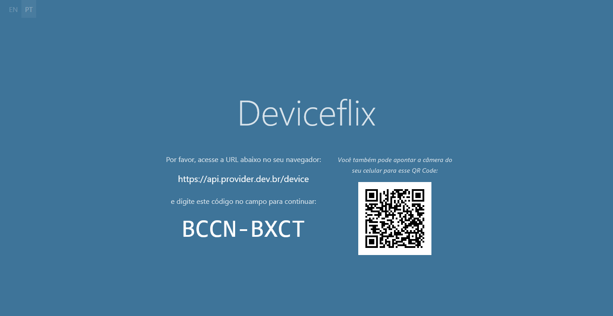
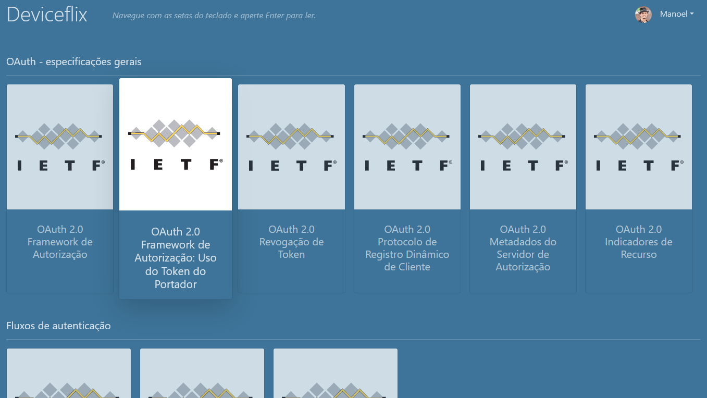

# Dispositivo Exemplo _(Deviceflix)_

Este é um exemplo de dispositivo que irá requisitar um acesso ao servidor de autorização.
Note que apesar de termos dois subprojetos aqui, um `server` e um `client`, normalmente um dispositivo tem a tela e o "servidor" num projeto único.
Aqui foi separado apenas por simplicidade e para manter o padrão dos outros projetos.

Para utilidade, o dispositivo simula uma aplicação de _streaming_ de conteúdo, mostrando as RFCs estudadas e relacionadas à OAuth 2.0 como títulos de um catálogo, permitindo a leitura da especificação dentro do "dispositivo".

## Tecnologias e pacotes

Para desenvolvimento foi utilizado:

* Node 14.15.0
* [Vue CLI 4.5.9](https://next.cli.vuejs.org/)
  * [Vue.js 3](v3.vuejs.org/)
  * [Vue Router 4](next.router.vuejs.org/)
  * [Vue i18n](https://vue-i18n-next.intlify.dev)
* [Bootstrap 5 (beta 1)](https://getbootstrap.com/docs/5.0/)
  * Popper.js
* [Socket.io](https://socket.io) _(foi utilizado como uma outro forma ao invés de requisições HTTP, para um desenvolvimento futuro)_

> Note que alguns recursos estão em fase beta ou alpha e não são ainda indicados para ambientes produtivos.

## Fluxo de dispositivo

Este projeto foi feito para simular um dispositivo usando o _device flow_ do OAuth 2.0 [RFC 8628](https://tools.ietf.org/html/rfc8628).
Para consultar mais detalhes, consulte o [estudo do OpenID](../../OpenID.md) no diretório raíz.

O projeto implementa:

* A geração dos códigos de dispositivo e usuário.
* A exibição do código do usuário na tela e indicação do processo de autenticação.
* A implementação do `verification_uri_complete` através da geração de um QR Code.

## Back-end

Consulte o [leia-me](../server/README.md) do back-end da aplicação.

## Comandos do Vue CLI

* Iniciar a primeira vez

  ```console
  npm i
  ```

* Compilar e atualizar automaticamente em desenvolvimento

  ```console
  npm run serve
  ```

* Compilar e minificar para produção

  ```console
  npm run build
  ```

* Rodar testes unitários

  ```console
  npm run test:unit
  ```

* Rodar testes ponta a ponta (E2E)

  ```console
  npm run test:e2e
  ```

* Validar código e arrumar arquivos

  ```console
  npm run lint
  ```

### Personalizar a configuração

Veja a [Referência de Configuração](https://cli.vuejs.org/config/).

## Telas

_Indicações para interação - "Login do dispositivo"_


_Tela do Deviceflix após o fluxo de autenticação estar completo_

